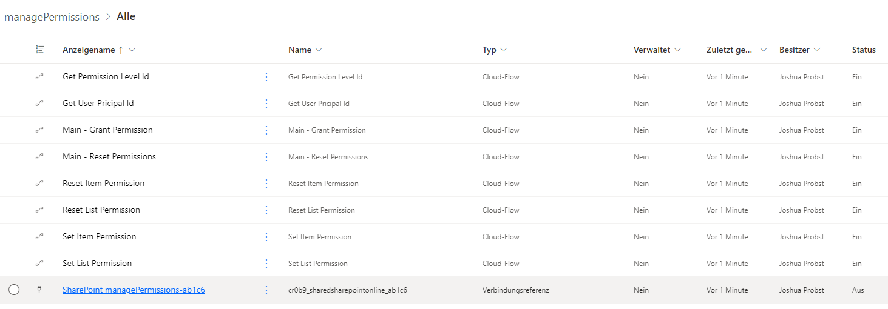
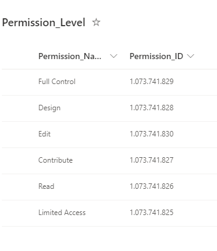
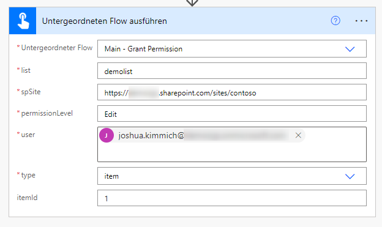
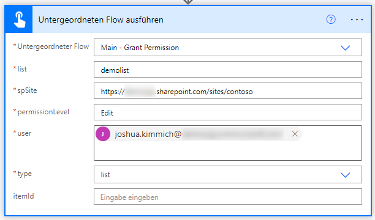
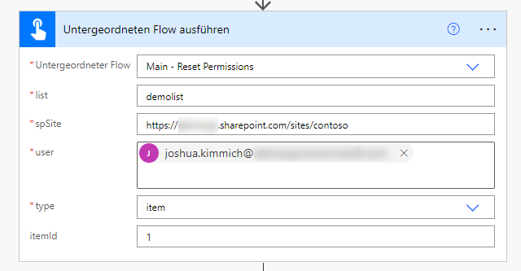
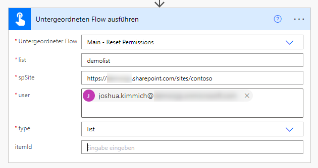
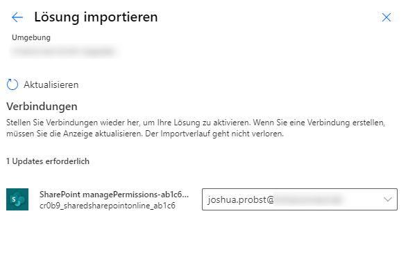

# Manage SharePoint Online Permissions with HTTP-Requests in Power Automate 

Here is my example how to manage SharePoint Online permissions without any third-party providers. Only thing you need to do is to store your flow in a solution. So you can call flows from another. 

## Use-Case

A large part of my actions in Power Automate are used to manage the assignment of permissions. In thise case we used third-party providers. The advantage was the quick integration of the actions. The disadvantage was failed runs due to the license package being exceeded. It was always possible to use HTTP requests to assign authorizations. However, the disadvantage of this method was that all actions in the flow would have to be adjusted if changes were made to the HTTP request.



## Structure

The script "create_SharepointList.ps1" creates the the list "Permission_Level". 
This list stores the available permissions levels of the SharePoint page. This is needed to get ID of the permission you want to grant.



# Call flows / use functionality:

Using action [run a child flow](https://learn.microsoft.com/en-us/power-automate/create-child-flows).

## Grant permissions

### Item permission


### List permission


## Remove permissions

### Item permission


### List permission



# Before you start: Set up the dependencies

### [Install PnP.PowerShell](https://pnp.github.io/powershell/) 

```powershell
Install-Module PnP.PowerShell -Force
```

### Run Script create_SharePointLists.ps1

```powershell
create_SharePointLists.ps1 -spSite "<Enter the URL of your SharePoint Site here>
```

### Import the solution to your power automate environment

Import the solution "managePermissions.zip" to your environment and add the new connection to SharePoint Online: 



YOU ARE DONE! You can now use the flow to manage your permissions in SharePoint Online.

##

| Author |
| ----------- |
| [Joshua Probst](https://github.com/joshua-probst) |
